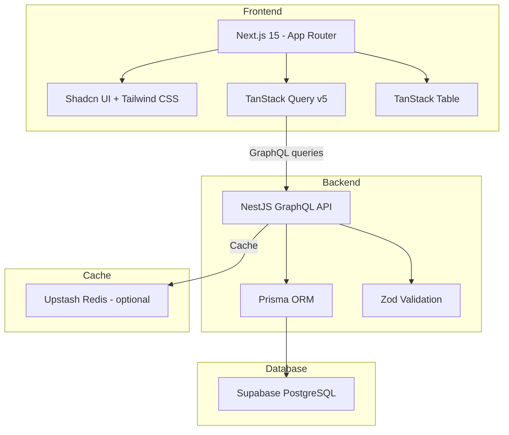
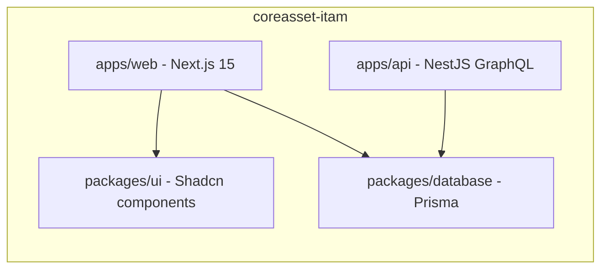
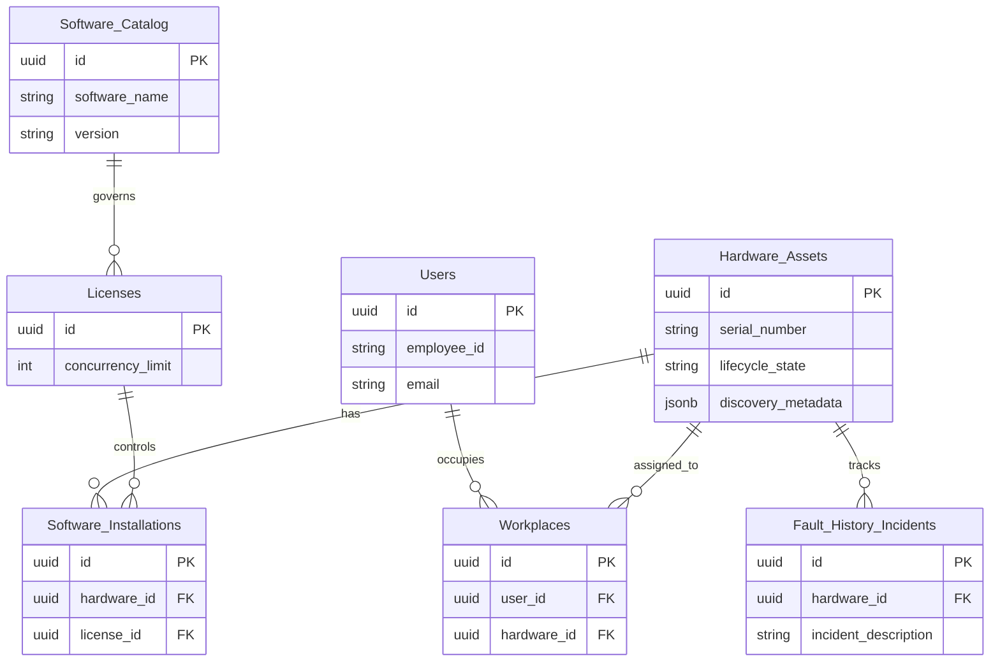
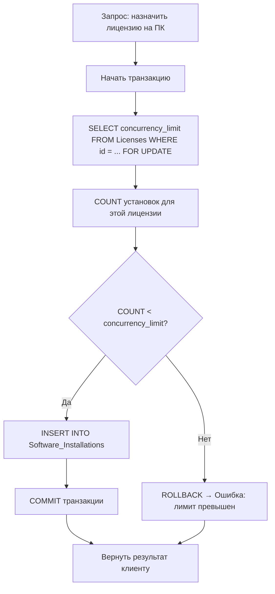
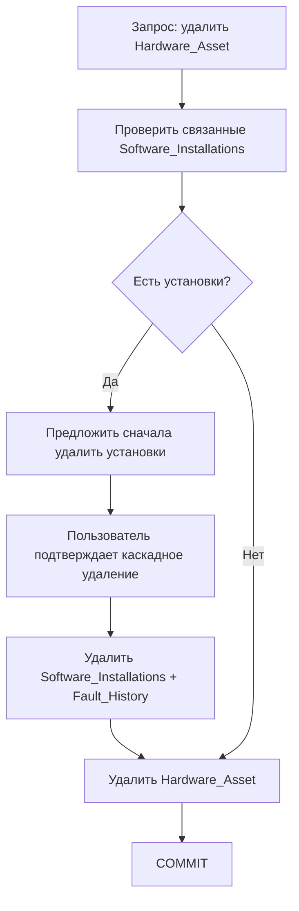

# CoreAsset — Детализированный план реализации

> План основан на спецификации из [`README.md`](../README.md) и адаптирован для пошагового выполнения.

---

## 1. Обзор проекта

**CoreAsset** — система управления ИТ-активами (ITAM) для учета рабочих мест, оборудования и программных лицензий. Проект строится как монорепозиторий на Turborepo с двумя приложениями (Next.js фронтенд + NestJS бэкенд) и двумя общими пакетами (Prisma database + Shadcn UI).

### Архитектура системы

### Структура монорепозитория

---

## 2. ER-диаграмма базы данных

---

## 3. Фазы реализации

### Фаза 1: Инициализация проекта и инфраструктура

| # | Задача | Детали |
|---|--------|--------|
| 1.1 | Инициализация Turborepo монорепозитория | `pnpm create turbo` → структура `apps/web`, `apps/api`, `packages/database`, `packages/ui` |
| 1.2 | Настройка `package.json` и `turbo.json` | Конфигурация pipeline: `build`, `dev`, `lint`, `db:push`, `db:seed` |
| 1.3 | Создание `.env.example` и `.env` | `DATABASE_URL` для Supabase, `NEXT_PUBLIC_GRAPHQL_API_URL` |
| 1.4 | Создание проекта Supabase | Регистрация, новый проект, копирование Transaction connection string |
| 1.5 | Настройка Prisma в `packages/database` | `pnpm add prisma @prisma/client`, инициализация `schema.prisma` |
| 1.6 | Определение всех 7 сущностей в `schema.prisma` | Hardware_Assets, Users, Workplaces, Software_Catalog, Licenses, Software_Installations, Fault_History_Incidents — с UUID PK, связями и индексами |
| 1.7 | Запуск миграций `db:push` | Синхронизация схемы с облачной БД Supabase |
| 1.8 | Создание seed-скрипта | Тестовые данные: 10+ ПК, 5+ сотрудников, 5+ лицензий, 3+ инцидентов |

### Фаза 2: Backend — NestJS GraphQL API

| # | Задача | Детали |
|---|--------|--------|
| 2.1 | Инициализация NestJS в `apps/api` | `pnpm nest new api` с GraphQL модулем |
| 2.2 | Настройка GraphQL CodeGen | Автогенерация TypeScript типов из `schema.prisma` через `@prisma/nestjs-graphql` |
| 2.3 | Создание модулей по доменам | `HardwareModule`, `UsersModule`, `WorkplacesModule`, `SoftwareModule`, `LicensesModule`, `FaultsModule` |
| 2.4 | Реализация CRUD резолверов | `create`, `read`, `update`, `delete` для каждой сущности с Prisma Service |
| 2.5 | Валидация входных данных через Zod | DTO-классы с `zodValidationPipe` для всех mutation-аргументов |
| 2.6 | **Критическая бизнес-логика: проверка лимита лицензий** | При `createSoftwareInstallation` — транзакция с пессимистической блокировкой: `SELECT ... FOR UPDATE` на `Licenses.concurrency_limit`, затем COUNT установок, затем INSERT если лимит не превышен |
| 2.7 | Безопасное удаление с защитой от сирот | Перед удалением `Hardware_Assets` — проверка наличия связанных `Software_Installations`; удаление `User` — открепление от `Workplaces` |
| 2.8 | Поиск и фильтрация | GraphQL queries: `hardwareBySerialNumber`, `hardwareByLifecycleState`, `usersByName`, `workplacesWithFilters` |
| 2.9 | Агрегированная аналитика | `dashboardStats`: количество свободных/занятых лицензий, оборудование по статусам, количество открытых инцидентов |
| 2.10 | Настройка CORS и error filters | Глобальный `GraphQLExceptionFilter`, CORS для фронтенда |

### Фаза 3: Frontend — Next.js 15 App Router

| # | Задача | Детали |
|---|--------|--------|
| 3.1 | Инициализация Next.js 15 в `apps/web` | `pnpm create next-app` с App Router, Tailwind CSS, TypeScript |
| 3.2 | Установка и настройка Shadcn UI | `pnpm shadcn-ui init`, выбор компонентов: Table, Form, Dialog, Card, Badge, Button, Input, Select |
| 3.3 | Настройка GraphQL клиента | `@apollo/client` или `graphql-request` + интеграция с TanStack Query v5 |
| 3.4 | Настройка TanStack Query v5 | `QueryClientProvider` в layout, кастомные hooks для queries/mutations |
| 3.5 | **Страница Dashboard** `/` | Карточки статистики: свободные лицензии, оборудование по статусам, открытые инциденты |
| 3.6 | **Инвентарные списки** `/hardware`, `/users`, `/workplaces`, `/licenses` | TanStack Table с сортировкой, фильтрацией, пагинацией |
| 3.7 | **Детальные карточки** `/hardware/[id]`, `/workplaces/[id]` | Полная информация об активе с привязанным ПО и историей неисправностей |
| 3.8 | **Формы добавления** `/hardware/new`, `/users/new`, `/licenses/new` | React Hook Form + Zod schema validation → GraphQL mutation |
| 3.9 | **Формы редактирования** `/hardware/[id]/edit` | Изменение lifecycle_state, характеристик устройства |
| 3.10 | **Механизм безопасного удаления** | Dialog с подтверждением, проверка связанных записей перед удалением |
| 3.11 | **Поиск по серийному номеру / ФИО** | Компонент SearchBar с debounce, интеграция с GraphQL search queries |
| 3.12 | **Форма регистрации инцидента** `/hardware/[id]/fault/new` | Добавление записи в Fault_History_Incidents |

### Фаза 4: Интеграция и тестирование

| # | Задача | Детали |
|---|--------|--------|
| 4.1 | Сквозная интеграция фронтенд ↔ бэкенд | Проверка всех CRUD-операций через UI → GraphQL → Prisma → PostgreSQL |
| 4.2 | Тестирование конкурентности лицензий | Симуляция параллельных запросов на назначение лицензии — проверка что лимит не превышается |
| 4.3 | Тестирование безопасного удаления | Попытка удаления записи с зависимостями — проверка что сироты не появляются |
| 4.4 | Функциональное тестирование всех форм | Валидация обязательных полей, форматы данных, граничные случаи |
| 4.5 | Регрессионное тестирование | Повторная проверка после баг-фиксов |

### Фаза 5: Деплой и документация

| # | Задача | Детали |
|---|--------|--------|
| 5.1 | Деплой бэкенда на Koyeb | Build: `pnpm run build --filter api`, Run: `pnpm run start:prod --filter api`, env: `DATABASE_URL` |
| 5.2 | Деплой фронтенда на Vercel | Root Directory: `apps/web`, env: `NEXT_PUBLIC_GRAPHQL_API_URL` → URL бэкенда на Koyeb |
| 5.3 | Проверка работающего продакшена | Сквозное тестирование на облачных URL |
| 5.4 | Обновление README.md | Финальная версия с актуальными ссылками, скриншотами, инструкциями |
| 5.5 | Руководство пользователя | Описание всех функций, скриншоты, пошаговые инструкции |
| 5.6 | Презентация 10-14 слайдов | Проблема → Аналоги → Архитектура → БД → Функционал → Демо → Результаты |

---

## 4. Ключевые технические решения

### 4.1 Проверка лимита лицензий — транзакционная защита

Это самая критичная бизнес-логика в системе. Алгоритм:

### 4.2 Безопасное удаление — защита от осиротевших записей

---

## 5. Технологический стек — итоговая таблица

| Слой | Технология | Бесплатный тариф |
|------|-----------|-----------------|
| БД | Supabase PostgreSQL | 500 МБ, 50K пользователей |
| ORM | Prisma | Open-source |
| Backend | NestJS + GraphQL | Open-source |
| Валидация | Zod | Open-source |
| Frontend | Next.js 15 App Router | Open-source |
| UI | Shadcn UI + Tailwind CSS | Open-source |
| State | TanStack Query v5 | Open-source |
| Tables | TanStack Table | Open-source |
| Forms | React Hook Form + Zod | Open-source |
| Деплой FE | Vercel | 100 ГБ bandwidth |
| Деплой BE | Koyeb | 1 ГБ RAM, 0.25 vCPU |
| Кэш | Upstash Redis | Optional, free-tier |

---

## 6. Приоритеты и зависимости

```mermaid
flowchart LR
    subgraph P1[Фаза 1 - Инфраструктура]
        I1[Monorepo init]
        I2[Prisma schema]
        I3[Supabase setup]
        I4[Seed data]
    end

    subgraph P2[Фаза 2 - Backend]
        B1[NestJS init]
        B2[CRUD resolvers]
        B3[License lock logic]
        B4[Search + Analytics]
    end

    subgraph P3[Фаза 3 - Frontend]
        F1[Next.js init]
        F2[Shadcn setup]
        F3[Dashboard]
        F4[Lists + Cards]
        F5[Forms + Delete]
    end

    subgraph P4[Фаза 4 - Тестирование]
        T1[Integration]
        T2[Concurrency test]
    end

    subgraph P5[Фаза 5 - Деплой]
        D1[Koyeb BE]
        D2[Vercel FE]
        D3[Documentation]
    end

    I1 --> I2 --> I3 --> I4
    I4 --> B1 --> B2 --> B3 --> B4
    B4 --> F1 --> F2 --> F3 --> F4 --> F5
    F5 --> T1 --> T2
    T2 --> D1 --> D2 --> D3
```

---

## 7. Контрольные точки

| КТ | День | Критерий готовности |
|----|------|---------------------|
| №1 | День 5 | Спецификация ПО утверждена, черновой набросок сущностей БД |
| №2 | День 10 | Монорепозиторий инициализирован, Prisma схема + миграции, UI макеты |
| №3 | День 13 | CRUD + безопасное удаление работают на бэкенде |
| №4 | День 15 | Dashboard + аналитика + сквозная интеграция FE↔BE |
| №5 | День 17 | Баг-фиксы, стабильная версия, деплой на облако |
| Финал | День 20 | Полный комплект документации, презентация, публичная защита |